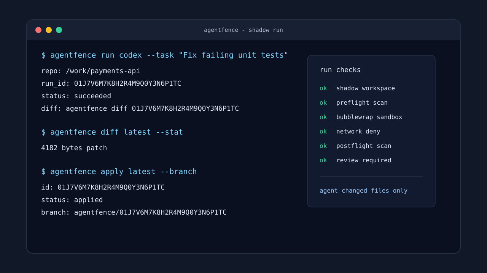

# AgentFence

Run AI coding agents without handing them your repo, your home directory, or your secrets.

AgentFence is a local security tool for the moment when you want help from Codex, Claude, Aider, OpenCode, or a custom agent, but you do not want that process to read everything on your machine. It creates a temporary shadow workspace, runs scanners before and after the agent, keeps the patch behind review, and only changes your real checkout when you explicitly apply the result.



The screenshot above is a hand-made terminal preview placeholder. It mirrors the normal CLI flow until real release captures exist.

## Why It Exists

Pointing an AI coding agent at a real repository is convenient. It is also a little too easy to expose `.env` files, cloud credentials, SSH keys, private Git history, local database dumps, or logs that were never meant to leave your laptop.

AgentFence keeps the agent in a smaller world:

- The agent works in a generated shadow workspace, not your real checkout.
- The original `.git` directory and Git history are not copied into that workspace.
- Dangerous paths are excluded by default and can be tightened per repo.
- `gitleaks` scans the exact files the agent will see before the agent starts.
- The changed workspace and generated patch are scanned again before `diff` or `apply`.
- Task text, logs, CLI output, API responses, and persisted run metadata go through redaction.
- The patch is never applied automatically.

This is not a promise that every bad patch is harmless. It is a practical fence around the common ways local secrets leak during agent-driven coding.

## Status

AgentFence is an MVP implementation with a deliberately narrow security contract. The core CLI, local daemon, SQLite run history, policy planner, scanners, sandbox adapters, and leak-lab fixtures are present in this repository.

The hard sandbox path is Linux plus `bubblewrap`. Soft mode exists for development and non-Linux workflows, but it is not treated as a sandbox and must be enabled explicitly.

## Requirements

- Go 1.26.x
- Git
- `gitleaks`
- Linux hard mode: `bubblewrap`
- Optional: `trufflehog`
- One or more agent CLIs, such as `codex`, `claude`, `aider`, or `opencode`

AgentFence is local-first. The daemon listens on a Unix socket by default. TCP is allowed only on `127.0.0.1` and only with a bearer token.

## Install From Source

```sh
git clone https://github.com/agentfence/agentfence.git
cd agentfence
go build -trimpath ./cmd/agentfence
install -m 0755 agentfence ~/.local/bin/agentfence
```

Then check the local environment:

```sh
agentfence doctor
```

If `doctor` fails, install the missing dependency before trusting a run. On Linux, `bubblewrap` and its runtime capability check both need to pass for hard mode.

## Quick Start

Run this from inside a Git repository:

```sh
agentfence init
agentfence doctor
agentfence run codex --task "Fix failing unit tests"
agentfence diff latest
agentfence apply latest --branch
```

The default config requires a clean working tree. That is intentional. It keeps AgentFence from mixing your half-finished local edits with agent output.

For a custom command, use the generic adapter:

```sh
agentfence run generic --command ./scripts/my-agent --task "Refactor the parser tests"
```

## How a Run Works

1. AgentFence finds the repository root and loads `.agentfence.yml`.
2. It builds an exposure plan from the include/exclude policy.
3. It creates a private run directory and a shadow Git workspace.
4. It scans the shadow workspace before the agent starts.
5. It runs the agent through the configured sandbox adapter.
6. It scans the changed workspace and the generated patch.
7. It stores run metadata, audit events, findings, and apply attempts in local SQLite.
8. It shows only the reviewed, redacted diff path.
9. It applies the patch only after `agentfence apply`.

If a blocking secret is found before the run, the agent never starts. If a blocking secret is found after the run, raw diff and apply are blocked.

## Commands

| Command | Purpose |
| --- | --- |
| `agentfence init` | Create `.agentfence.yml` with conservative defaults. |
| `agentfence doctor` | Check Git, scanners, sandbox support, state dirs, and disk space. |
| `agentfence scan` | Build and scan the shadow workspace without running an agent. |
| `agentfence run <agent>` | Run an agent in a shadow workspace. |
| `agentfence diff <run-id or latest>` | Show a redacted patch, unless postflight scanning blocked it. |
| `agentfence apply <run-id or latest>` | Apply a reviewed patch to the real repo. |
| `agentfence status` | List recent runs for the current repository. |
| `agentfence clean` | Remove retained run data according to local state. |
| `agentfence daemon` | Start the local HTTP API daemon. |

Useful flags:

```sh
agentfence run codex --task "..." --timeout 1800
agentfence run codex --task "..." --include-untracked
agentfence run codex --task "..." --include-dirty
agentfence run codex --task "..." --network allow
agentfence run codex --task "..." --allow-soft-mode
agentfence diff latest --stat
agentfence apply latest --branch
agentfence apply latest --branch-name agentfence/parser-tests
```

## Configuration

`agentfence init` writes a full config file. The important defaults are:

```yaml
workspace:
  require_clean_tree: true
  include:
    - "**"
  exclude:
    - ".git"
    - ".git/**"
    - ".env"
    - ".env.*"
    - "**/*.pem"
    - "**/*.key"
    - "**/.aws/**"
    - "**/.gcp/**"
    - "**/.azure/**"
    - "node_modules/**"
    - "vendor/**"

scan:
  enabled: true
  engines:
    - gitleaks
  fail_on_findings: true
  severity_blocklist:
    - critical
    - high
    - medium

sandbox:
  mode: bubblewrap
  network: deny
  allow_soft_mode: false

agent:
  env_allowlist:
    - PATH
    - TERM
  sanitized_env:
    enabled: true
    example_files:
      - ".env.example"
      - ".env.template"
      - ".env.sample"
    extra_keys: []

apply:
  require_clean_tree: true
  create_branch: true
  branch_prefix: "agentfence/"
```

Use `exclude_replace: true` when you want your repo-specific exclude list to replace the built-in defaults. Leave it false when you want to add a few project-specific paths on top.

## Agents

The built-in presets are thin wrappers around command-line tools:

| Agent | Command | Task delivery |
| --- | --- | --- |
| `codex` | `codex --no-interactive` | stdin |
| `claude` | `claude --non-interactive` | stdin |
| `aider` | `aider` | argv |
| `opencode` | `opencode` | stdin |
| `generic` | configured by `--command` or config | stdin or argv |

AgentFence does not install or authenticate these tools for you. Keep credentials outside the shadow workspace unless you intentionally add read-only `auth_mounts` in config.

## Local Daemon

Start the daemon on a Unix socket:

```sh
agentfence daemon
```

Or bind loopback TCP with a generated bearer token:

```sh
agentfence daemon --listen 127.0.0.1:17390 --token-file ~/.local/state/agentfence/daemon.token
```

API surface:

| Method | Path | Purpose |
| --- | --- | --- |
| `GET` | `/v1/health` | Health check. |
| `POST` | `/v1/runs` | Create and enqueue a run. |
| `GET` | `/v1/runs` | List runs. |
| `GET` | `/v1/runs/{id}` | Read one run. |
| `POST` | `/v1/runs/{id}/cancel` | Cancel a run. |
| `GET` | `/v1/runs/{id}/diff` | Read the redacted diff. |
| `POST` | `/v1/runs/{id}/apply` | Apply a reviewed patch. |
| `POST` | `/v1/scan` | Scan a repo through the AgentFence exposure policy. |

## Security Model

AgentFence is designed to reduce accidental local exposure during AI-assisted coding.

It aims to protect:

- The real checkout from direct agent writes.
- `$HOME`, SSH keys, cloud credentials, `.env` files, private keys, and common secret stores.
- The original Git history.
- Raw secrets in logs, CLI output, API responses, SQLite rows, and audit events.
- Patch application, which always requires an explicit command.

AgentFence can generate a sanitized `.env` inside the shadow workspace from `.env.example`, `.env.template`, `.env.sample`, and configured key names. It ignores source values, never reads real `.env` files by default, passes generated placeholder values to the agent process, scans the generated file, and excludes it from the final patch.

It does not protect against:

- A malicious change that you review, apply, and later run yourself.
- Kernel, `bubblewrap`, scanner, Git, or filesystem vulnerabilities.
- Secrets you intentionally mount into the sandbox.
- Network exposure when you set `network: allow`.
- Soft mode. Soft mode is env scrubbing plus a shadow workspace, not isolation.

The most important rule is simple: AgentFence can keep a patch behind a gate, but the review still belongs to you.

## Project Layout

```text
cmd/agentfence          CLI entrypoint
internal/cli            Cobra commands
internal/app            Application services
internal/domain         Domain types and status model
internal/policy         Exposure planning
internal/workspace      Shadow workspace and patch handling
internal/scanner        Gitleaks and TruffleHog adapters
internal/sandbox        Bubblewrap and soft-mode adapters
internal/storage/sqlite Local run history, events, findings, apply attempts
internal/api            Local daemon HTTP API
leaklab                 Acceptance fixtures for security behavior
```

## A Few Sharp Edges

- `apply_on_success` is intentionally absent. Automatic apply would defeat the review flow.
- The default scanner is mandatory `gitleaks`; `trufflehog` is opt-in.
- Raw patch files are local files with `0600` permissions.
- Postflight blocking findings prevent raw diff and apply.
- One active run per repository is enforced with a repo-level file lock.

## License

Licensed under the MIT License. See [LICENSE](LICENSE).

## Development

```sh
make fmt
make test
make race
make leaklab
make build
```

The CI workflow runs formatting checks, `go vet`, `golangci-lint`, `govulncheck`, unit tests, race tests, leak-lab tests, and Linux builds for amd64 and arm64.

Leak-lab fixtures live in `leaklab/` and exercise the security invariants with `bubblewrap` and `gitleaks` installed:

```sh
agentfence run generic --command ./leaklab/fake-agent.sh --task "probe"
agentfence diff latest
agentfence apply latest --branch
AF_INJECT_SECRET=1 agentfence run generic --command ./leaklab/fake-agent.sh --task "probe"
```

This project was developed with AI assistance and is maintained by the author.
